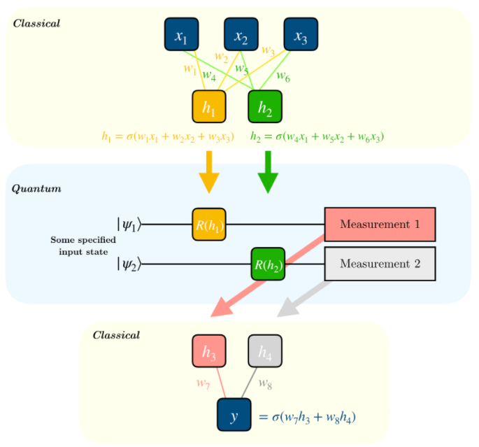

# Hybrid Neural Network with Qiskit and CNN

## Description
This project is to do research quantum in AI field. We created hybrid Neural Network with quantum circuit (IBM Qiskit) and CNN, and tried the model in different tasks such as classifying grayscale number image in MNIST Dataset and colorful pets image in The Oxford-IIIT Pet Dataset. 

## Structure

Quantum Circuit with CNN

 

## Datasets

MNIST Dataset

 
 

The Oxford-IIIT Pet Dataset

 

## Tools
- PyTorch
- Qiskit
- Colab

## Result
We used different amount of quantum in quantum circuit and compared the result in classifying cats and dogs of hybrid neural network with tanh and sigmoid function, found out the accuracy of hybrid neural network had no significant differences.
 

Handwriting Number Test Result

 

## Website
- [IBM Qiskit with Pytorch](https://qiskit.org/textbook/ch-machine-learning/machine-learning-qiskit-pytorch.html)
- [MNIST Dataset](http://yann.lecun.com/exdb/mnist/)
- [The Oxford-IIIT Pet Dataset](https://www.robots.ox.ac.uk/~vgg/data/pets/)
- [Google Colab](https://colab.research.google.com/notebooks/intro.ipynb)
